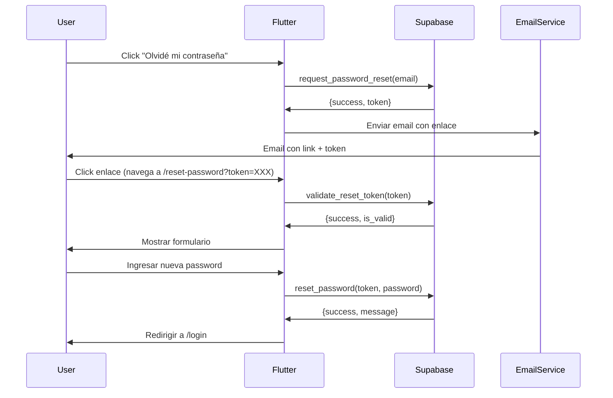

# APIs Backend - HU-004: Recuperar Contraseña

**Epic**: E001 - Autenticación
**Historia**: HU-004 - Recuperar Contraseña
**Agente**: @supabase-expert
**Fecha**: 2025-10-06
**Estado**: ✅ Implementado

---

## Funciones PostgreSQL

### 1. request_password_reset()

**Propósito**: Solicitar recuperación de contraseña

#### Firma
```sql
CREATE OR REPLACE FUNCTION request_password_reset(
    p_email TEXT,
    p_ip_address INET DEFAULT NULL
)
RETURNS JSON
```

#### Parámetros
- `p_email` (TEXT): Email del usuario
- `p_ip_address` (INET, opcional): IP de origen

#### Retorno
```json
{
  "success": true,
  "data": {
    "message": "Si el email existe, se enviara un enlace de recuperacion",
    "email_sent": true,
    "token": "AbCdEfGh1234567890...",
    "expires_at": "2025-10-07T21:45:00Z"
  }
}
```

#### Errores
```json
{
  "success": false,
  "error": {
    "code": "P0001",
    "message": "Ya se enviaron varios enlaces recientemente. Espera 15 minutos",
    "hint": "rate_limit"
  }
}
```

#### Lógica de Negocio
1. Validar formato de email
2. Buscar usuario en auth.users (case insensitive)
3. Si no existe → retornar mensaje genérico (privacidad)
4. Verificar rate limiting (3 solicitudes máx en 15 min)
5. Invalidar tokens anteriores del usuario
6. Generar token seguro (32 bytes URL-safe)
7. Guardar en password_recovery
8. Retornar token (para envío de email desde Flutter)

#### Reglas de Negocio Aplicadas
- **RN-004.1**: Validación de formato email
- **RN-004.2**: Privacidad (no revelar si email existe)
- **RN-004.3**: Rate limiting 15 minutos
- **RN-004.4**: Invalidar tokens previos
- **RN-004.5**: Token seguro URL-safe
- **RN-004.6**: Expiración 24 horas

---

### 2. validate_reset_token()

**Propósito**: Validar si un token de recuperación es válido

#### Firma
```sql
CREATE OR REPLACE FUNCTION validate_reset_token(
    p_token TEXT
)
RETURNS JSON
```

#### Parámetros
- `p_token` (TEXT): Token a validar

#### Retorno
```json
{
  "success": true,
  "data": {
    "is_valid": true,
    "user_id": "uuid-del-usuario",
    "email": "user@example.com",
    "expires_at": "2025-10-07T21:45:00Z"
  }
}
```

#### Errores Posibles
| Hint | Mensaje | Descripción |
|------|---------|-------------|
| missing_token | Token es requerido | Token vacío o null |
| invalid_token | Enlace de recuperacion invalido | Token no existe |
| expired_token | Enlace de recuperacion expirado | Token expiró (>24h) |
| used_token | Enlace ya utilizado | Token ya fue usado |

#### Lógica de Negocio
1. Verificar token no vacío
2. Buscar token en password_recovery
3. Verificar no expirado (expires_at > NOW())
4. Verificar no usado (used_at IS NULL)
5. Retornar datos del usuario

---

### 3. reset_password() - ⚠️ MIGRADO A EDGE FUNCTION

**Estado**: DEPRECADO - Usar Edge Function `/functions/reset-password` en su lugar

**Razón**: Conflicto con `auth.users.encrypted_password` en PostgreSQL. Supabase Auth requiere uso de Admin API.

**Función SQL**: Mantenida solo como fallback/referencia. NO usar directamente.

---

## Edge Functions

### Edge Function: reset-password

**Propósito**: Cambiar contraseña usando token de recuperación mediante Supabase Admin API

**Ubicación**: `supabase/functions/reset-password/index.ts`

#### HTTP Request
```
POST /functions/v1/reset-password
Content-Type: application/json
```

#### Body
```json
{
  "token": "AbCdEfGh1234567890...",
  "newPassword": "NewPassword123!",
  "ipAddress": "127.0.0.1"
}
```

#### Response Success (200)
```json
{
  "success": true,
  "data": {
    "message": "Contraseña actualizada exitosamente. Por seguridad, todas las sesiones activas han sido cerradas."
  }
}
```

#### Response Error (400/500)
```json
{
  "success": false,
  "error": {
    "message": "La contraseña debe tener al menos 8 caracteres",
    "hint": "weak_password"
  }
}
```

#### Error Hints
| Hint | Status | Mensaje | Causa |
|------|--------|---------|-------|
| missing_params | 400 | Token y nueva contraseña son requeridos | Falta token o password |
| weak_password | 400 | La contraseña debe tener al menos 8 caracteres | < 8 chars |
| invalid_token | 400 | Token inválido o expirado | Token no válido |
| expired_token | 400 | Enlace de recuperacion expirado | Token expirado |
| used_token | 400 | Enlace ya utilizado | Token ya usado |
| validation_error | 500 | Error al validar token | Error interno en validación |
| update_failed | 500 | Error al actualizar contraseña | Error en Admin API |
| internal_error | 500 | Error interno del servidor | Error inesperado |

#### Lógica de Negocio
1. Validar token y password no vacíos
2. Validar password >= 8 caracteres
3. Llamar a `validate_reset_token()` RPC para verificar token
4. Actualizar password usando **Supabase Admin API** (`admin.updateUserById()`)
5. Marcar token como usado (`password_recovery.used_at = NOW()`)
6. Cerrar sesiones activas usando **Admin API** (`admin.signOut()`)
7. Registrar en `audit_log` (event_type: 'password_reset')
8. Retornar confirmación

#### Ventajas vs Función SQL
- ✅ Usa Supabase Admin API (método correcto para actualizar passwords)
- ✅ Evita conflictos con `auth.users.encrypted_password`
- ✅ Hashing automático gestionado por Supabase Auth
- ✅ Soporte nativo para políticas de seguridad de passwords
- ✅ Logs centralizados en Supabase Dashboard

#### Reglas de Negocio Aplicadas
- **RN-004.7**: Validar fortaleza de contraseña (min 8 chars)
- **RN-004.8**: Actualizar password con Admin API (hashing automático)
- **RN-004.9**: Marcar token como usado
- **RN-004.10**: Invalidar sesiones activas
- **RN-004.11**: Auditoría del cambio

---

### 4. cleanup_expired_recovery_tokens()

**Propósito**: Limpiar tokens expirados (mantenimiento)

#### Firma
```sql
CREATE OR REPLACE FUNCTION cleanup_expired_recovery_tokens()
RETURNS JSON
```

#### Parámetros
Ninguno

#### Retorno
```json
{
  "success": true,
  "data": {
    "deleted_count": 42,
    "cleaned_at": "2025-10-06T21:45:00Z"
  }
}
```

#### Lógica de Negocio
1. Eliminar todos los tokens donde expires_at < NOW()
2. Retornar cantidad eliminada

#### Uso
- Llamar manualmente vía pgAdmin
- Programar como cron job (recomendado: diario)
- Ejecutar desde Edge Function de mantenimiento

---

## Security

### SECURITY DEFINER
Todas las funciones usan `SECURITY DEFINER` para ejecutarse con privilegios del propietario (postgres), permitiendo:
- Acceso a auth.users (schema protegido)
- Modificación de encrypted_password
- Eliminación de refresh_tokens

### Protecciones Implementadas

1. **Validación de Entrada**
   - Regex para email
   - Verificación de parámetros no vacíos
   - Validación de longitud de password

2. **Rate Limiting**
   - Máximo 3 solicitudes en 15 minutos
   - Por usuario (no por IP)

3. **Tokens Seguros**
   - 32 bytes random (gen_random_bytes)
   - URL-safe encoding (base64 sin +/=)
   - Únicos (constraint UNIQUE)

4. **Privacidad**
   - No revela si email existe
   - Mensaje genérico siempre

5. **Auditoría**
   - Registro en audit_log
   - IP address tracking
   - Timestamp de uso

---

## Testing Manual

### Test 1: Solicitar recuperación
```sql
SELECT request_password_reset('admin@test.com', '127.0.0.1'::INET);
```

### Test 2: Validar token
```sql
-- Usar token del Test 1
SELECT validate_reset_token('TOKEN_AQUI');
```

### Test 3: Cambiar password
```sql
SELECT reset_password('TOKEN_AQUI', 'NewPassword123!', '127.0.0.1'::INET);
```

### Test 4: Rate limiting
```sql
-- Ejecutar 4 veces seguidas
SELECT request_password_reset('admin@test.com', '127.0.0.1'::INET);
```

### Test 5: Token expirado
```sql
-- Modificar expires_at a pasado
UPDATE password_recovery SET expires_at = NOW() - INTERVAL '1 hour' WHERE token = 'TOKEN_AQUI';
SELECT validate_reset_token('TOKEN_AQUI');
```

### Test 6: Cleanup
```sql
SELECT cleanup_expired_recovery_tokens();
```

---

## Integración con Frontend

### Flujo Completo



### Endpoints Frontend

```dart
// 1. Solicitar recuperación
final response = await supabase
    .rpc('request_password_reset', params: {
      'p_email': email,
      'p_ip_address': userIP,
    });

// 2. Validar token
final response = await supabase
    .rpc('validate_reset_token', params: {
      'p_token': token,
    });

// 3. Cambiar password - ⚠️ USAR EDGE FUNCTION
final response = await supabase.functions.invoke(
  'reset-password',
  body: {
    'token': token,
    'newPassword': newPassword,
    'ipAddress': userIP,
  },
);

// Verificar respuesta
if (response.status == 200) {
  final data = response.data as Map<String, dynamic>;
  if (data['success'] == true) {
    // Password actualizado exitosamente
  }
}
```

---

## Próximos Pasos

- ✅ Funciones implementadas
- ✅ Testing manual ejecutado
- ⏳ Integración con Flutter (@flutter-expert)
- ⏳ Envío de emails (Edge Function o servicio externo)
- ⏳ UI Components (@ux-ui-expert)
- ⏳ Testing end-to-end (@qa-testing-expert)

---

**Implementado por**: @supabase-expert
**Fecha**: 2025-10-06
**Migration**: 20251006214500_hu004_password_recovery.sql
