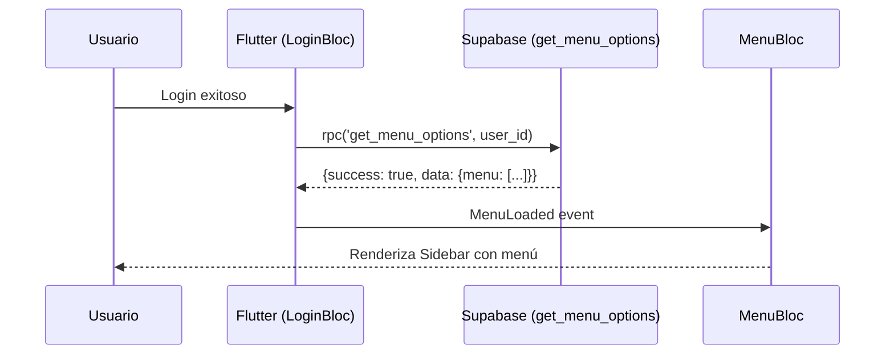
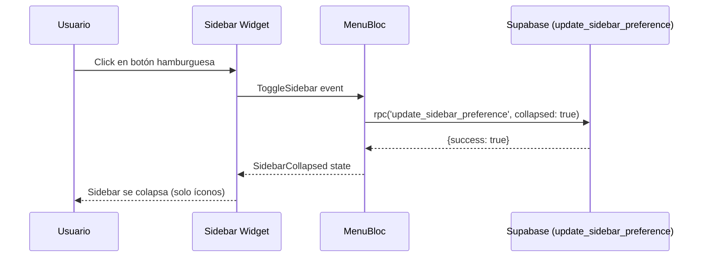
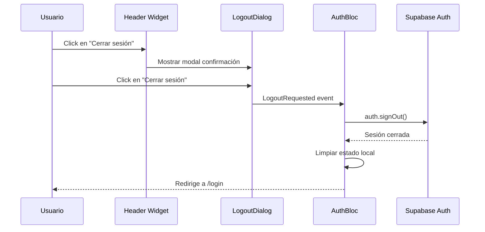

# APIs Backend - E003-HU-002: Sistema de Navegación con Menús Desplegables

**Historia de Usuario**: E003-HU-002
**Fecha creación**: 2025-10-06
**Autor**: @web-architect-expert
**Estado**: ✅ Implementado (2025-10-06)
**Migration**: `20251006112745_hu002_navigation_menus.sql`

---

## 🎯 OBJETIVO

Documentar las APIs (funciones PostgreSQL) que el frontend consumirá para el sistema de navegación con menús dinámicos.

---

## 📡 ENDPOINTS (PostgreSQL Functions vía Supabase RPC)

### 1. `get_menu_options` - Obtener Menú del Usuario

**Descripción**: Devuelve el menú jerárquico según el rol del usuario autenticado.

**Parámetros**:
```typescript
{
  p_user_id: string  // UUID del usuario autenticado
}
```

**Respuesta Exitosa**:
```json
{
  "success": true,
  "data": {
    "role": "VENDEDOR",
    "menu": [
      {
        "id": "dashboard",
        "label": "Dashboard",
        "icon": "dashboard",
        "route": "/dashboard",
        "children": null
      },
      {
        "id": "pos",
        "label": "Punto de Venta",
        "icon": "point_of_sale",
        "route": "/pos",
        "children": null
      },
      {
        "id": "productos",
        "label": "Productos",
        "icon": "inventory",
        "route": null,
        "children": [
          {
            "id": "productos-catalogo",
            "label": "Gestionar catálogo",
            "icon": null,
            "route": "/products"
          }
        ]
      },
      {
        "id": "clientes",
        "label": "Clientes",
        "icon": "people",
        "route": null,
        "children": [
          {
            "id": "clientes-registrar",
            "label": "Registrar cliente",
            "icon": null,
            "route": "/clientes/register"
          },
          {
            "id": "clientes-base",
            "label": "Base de datos de clientes",
            "icon": null,
            "route": "/clientes"
          }
        ]
      }
    ]
  }
}
```

**Respuesta de Error**:
```json
{
  "success": false,
  "error": {
    "code": "user_not_found",
    "message": "Usuario no encontrado o no autorizado",
    "hint": "user_not_authorized"
  }
}
```

**Ejemplo de Uso (Dart)**:
```dart
final response = await supabase
    .rpc('get_menu_options', params: {
      'p_user_id': currentUser.id,
    });

if (response['success'] == true) {
  final menuData = response['data'];
  final role = menuData['role'];
  final menu = menuData['menu'] as List;
  // Procesar menú...
} else {
  final error = response['error'];
  throw ServerException(error['message'], 500);
}
```

**Casos de Uso**:
- **CA-001**: Vendedor autenticado → Recibe menú con opciones de vendedor
- **CA-002**: Gerente autenticado → Recibe menú con opciones de gerente
- **CA-003**: Admin autenticado → Recibe menú completo

**Validaciones**:
- ✅ Usuario debe existir
- ✅ Usuario debe estar en estado `APROBADO`
- ✅ Menú debe incluir solo opciones activas (`activo = true`)
- ✅ Menú debe estar ordenado por campo `orden`

---

### 2. `update_sidebar_preference` - Actualizar Preferencia de Sidebar

**Descripción**: Guarda la preferencia del usuario sobre el estado del sidebar (expandido/colapsado).

**Parámetros**:
```typescript
{
  p_user_id: string,     // UUID del usuario
  p_collapsed: boolean   // true = colapsado, false = expandido
}
```

**Respuesta Exitosa**:
```json
{
  "success": true,
  "data": {
    "sidebar_collapsed": true,
    "message": "Preferencia actualizada"
  }
}
```

**Respuesta de Error**:
```json
{
  "success": false,
  "error": {
    "code": "user_not_found",
    "message": "Usuario no encontrado",
    "hint": "user_not_found"
  }
}
```

**Ejemplo de Uso (Dart)**:
```dart
Future<void> updateSidebarPreference(bool collapsed) async {
  final response = await supabase.rpc('update_sidebar_preference', params: {
    'p_user_id': currentUser.id,
    'p_collapsed': collapsed,
  });

  if (response['success'] != true) {
    final error = response['error'];
    throw ServerException(error['message'], 500);
  }
}
```

**Casos de Uso**:
- **CA-005**: Usuario colapsa sidebar → Se guarda preferencia `sidebar_collapsed = true`
- **CA-005**: Usuario expande sidebar → Se guarda preferencia `sidebar_collapsed = false`

**Validaciones**:
- ✅ Usuario debe existir
- ✅ Parámetro `p_collapsed` es obligatorio (boolean)

---

### 3. `get_user_profile` - Obtener Perfil de Usuario para Header

**Descripción**: Devuelve información del usuario para mostrar en el header (avatar, nombre, rol).

**Parámetros**:
```typescript
{
  p_user_id: string  // UUID del usuario
}
```

**Respuesta Exitosa**:
```json
{
  "success": true,
  "data": {
    "id": "uuid-123",
    "nombre_completo": "Juan Pérez",
    "email": "juan@example.com",
    "rol": "VENDEDOR",
    "avatar_url": null,
    "sidebar_collapsed": false
  }
}
```

**Respuesta de Error**:
```json
{
  "success": false,
  "error": {
    "code": "user_not_found",
    "message": "Usuario no encontrado",
    "hint": "user_not_found"
  }
}
```

**SQL de la Función**:
```sql
CREATE OR REPLACE FUNCTION get_user_profile(p_user_id UUID)
RETURNS JSON AS $$
DECLARE
    v_user JSON;
BEGIN
    SELECT json_build_object(
        'success', true,
        'data', json_build_object(
            'id', id,
            'nombre_completo', nombre_completo,
            'email', email,
            'rol', rol,
            'avatar_url', avatar_url,
            'sidebar_collapsed', sidebar_collapsed
        )
    ) INTO v_user
    FROM users
    WHERE id = p_user_id AND estado = 'APROBADO';

    IF v_user IS NULL THEN
        RETURN json_build_object(
            'success', false,
            'error', json_build_object(
                'code', 'user_not_found',
                'message', 'Usuario no encontrado',
                'hint', 'user_not_found'
            )
        );
    END IF;

    RETURN v_user;

EXCEPTION
    WHEN OTHERS THEN
        RETURN json_build_object(
            'success', false,
            'error', json_build_object(
                'code', SQLSTATE,
                'message', SQLERRM,
                'hint', 'unknown'
            )
        );
END;
$$ LANGUAGE plpgsql SECURITY DEFINER;
```

**Ejemplo de Uso (Dart)**:
```dart
final response = await supabase.rpc('get_user_profile', params: {
  'p_user_id': currentUser.id,
});

if (response['success'] == true) {
  final userData = response['data'];
  final user = UserModel.fromJson(userData);
  // Usar datos en Header
}
```

**Casos de Uso**:
- **CA-006**: Mostrar avatar con inicial del nombre
- **CA-006**: Mostrar nombre completo y rol en header
- **CA-005**: Cargar preferencia de sidebar al iniciar sesión

---

### 4. `logout_user` - Cerrar Sesión

**Descripción**: Invalida la sesión actual del usuario (opcional, Supabase lo maneja automáticamente).

**Parámetros**:
```typescript
{
  p_user_id: string  // UUID del usuario
}
```

**Respuesta Exitosa**:
```json
{
  "success": true,
  "data": {
    "message": "Sesión cerrada exitosamente"
  }
}
```

**Ejemplo de Uso (Dart)**:
```dart
Future<void> logout() async {
  // Opción 1: Usar Supabase Auth directamente (RECOMENDADO)
  await supabase.auth.signOut();

  // Opción 2: Si necesitas lógica adicional en backend
  final response = await supabase.rpc('logout_user', params: {
    'p_user_id': currentUser.id,
  });

  if (response['success'] == true) {
    // Limpiar estado local
    await prefs.clear();
    context.go('/login');
  }
}
```

**Casos de Uso**:
- **CA-006**: Usuario hace clic en "Cerrar sesión"
- **CA-006**: Mostrar modal de confirmación
- **CA-006**: Ejecutar logout y redirigir a login

**Validaciones**:
- ✅ Sesión debe ser invalidada en Supabase Auth
- ✅ Frontend debe limpiar estado local (SharedPreferences, Bloc)

---

## 🔄 FLUJO DE INTEGRACIÓN COMPLETO

### Flujo 1: Cargar Menú al Iniciar Sesión



### Flujo 2: Colapsar/Expandir Sidebar



### Flujo 3: Logout con Confirmación



---

## 📋 TABLA DE HINTS DE ERROR

| Hint | Descripción | HTTP Status (Frontend) |
|------|-------------|------------------------|
| `user_not_authorized` | Usuario no tiene permisos | 403 Forbidden |
| `user_not_found` | Usuario no existe o inactivo | 404 Not Found |
| `invalid_role` | Rol de usuario inválido | 400 Bad Request |
| `menu_empty` | No hay menús disponibles para el rol | 404 Not Found |
| `unknown` | Error genérico del servidor | 500 Internal Server Error |

---

## 📝 NOTAS PARA @supabase-expert

### Implementación Requerida:

1. **Crear funciones SQL**:
   - ✅ `get_menu_options(p_user_id UUID)`
   - ✅ `update_sidebar_preference(p_user_id UUID, p_collapsed BOOLEAN)`
   - ✅ `get_user_profile(p_user_id UUID)`

2. **Aplicar seed data**:
   - ✅ Insertar menús base en `menu_options`
   - ✅ Configurar permisos en `menu_permissions` para cada rol

3. **Configurar RLS**:
   - ✅ Policies de lectura para usuarios autenticados
   - ✅ Policies de modificación solo para ADMIN

4. **Testing manual**:
   ```sql
   -- Test 1: Menú de Vendedor
   SELECT get_menu_options('uuid-vendedor-test');

   -- Test 2: Menú de Gerente
   SELECT get_menu_options('uuid-gerente-test');

   -- Test 3: Menú de Admin
   SELECT get_menu_options('uuid-admin-test');

   -- Test 4: Actualizar preferencia
   SELECT update_sidebar_preference('uuid-test', true);
   ```

---

## 📝 NOTAS PARA @flutter-expert

### Repositorios a Implementar:

1. **MenuRepository**:
   ```dart
   abstract class MenuRepository {
     Future<MenuResponse> getMenuOptions(String userId);
     Future<void> updateSidebarPreference(String userId, bool collapsed);
   }
   ```

2. **UserProfileRepository**:
   ```dart
   abstract class UserProfileRepository {
     Future<UserProfile> getUserProfile(String userId);
   }
   ```

### Datasources:

1. **MenuRemoteDatasource**:
   - Consumir `get_menu_options`
   - Consumir `update_sidebar_preference`

2. **UserProfileRemoteDatasource**:
   - Consumir `get_user_profile`

---

**Próximos pasos**: Documentar modelos frontend en `models_E003-HU-002.md`